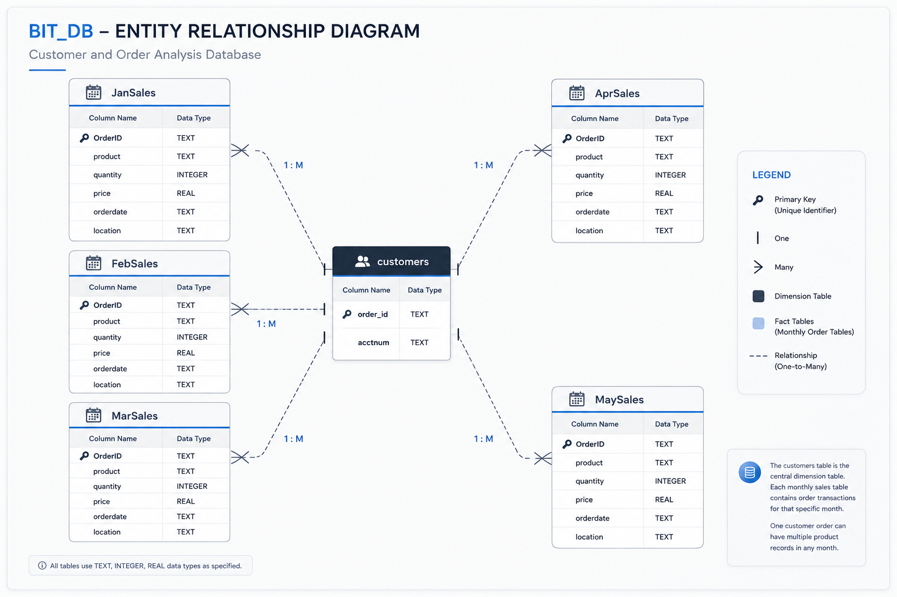
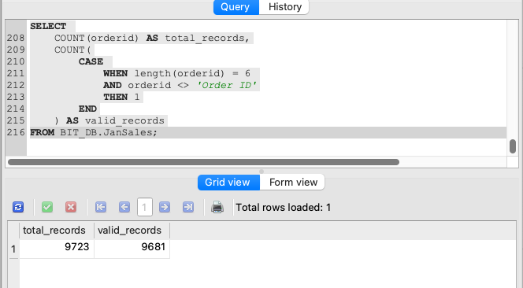
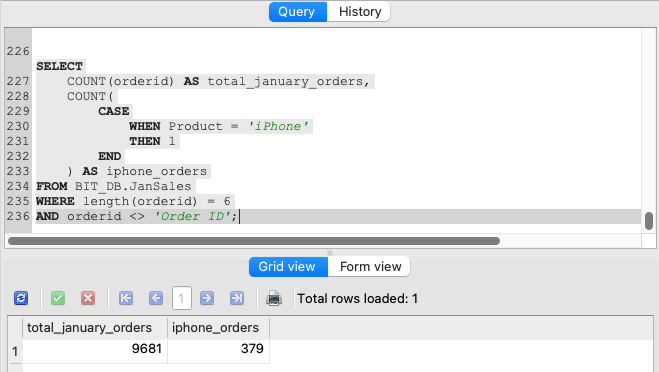
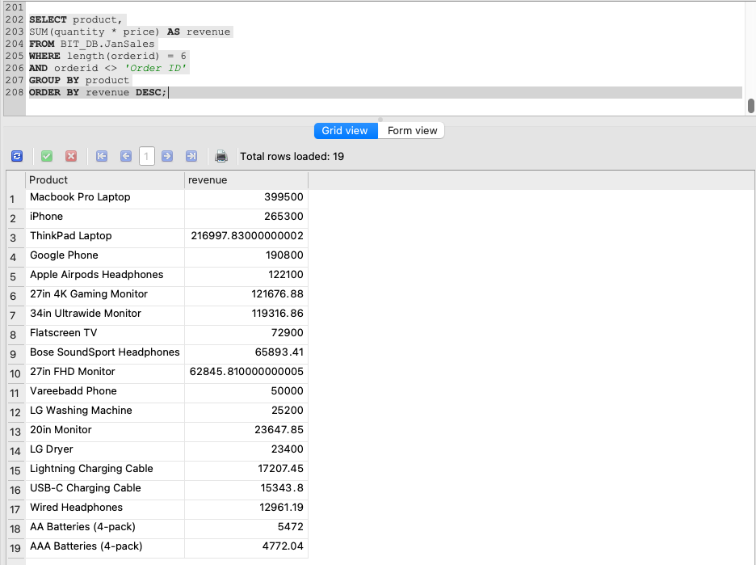
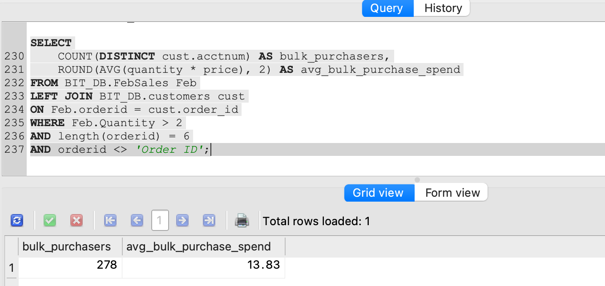
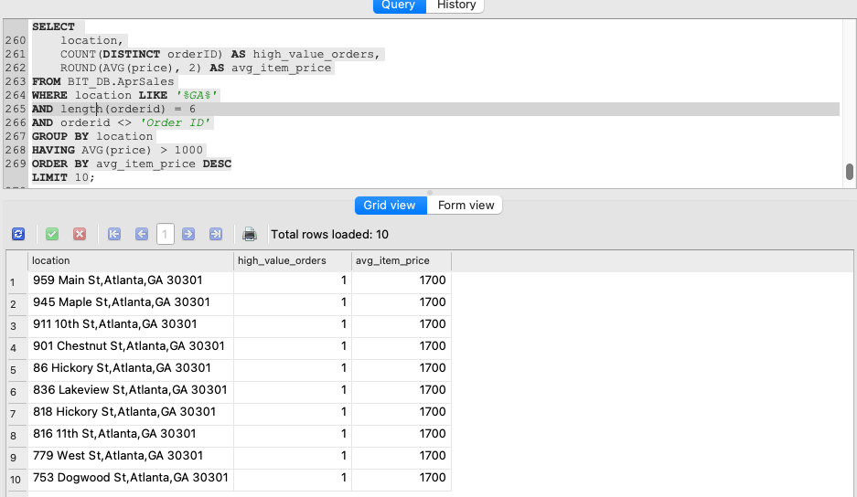

# Retail Sales & Customer Behaviour Analysis: Monthly Trends, Product Performance & Geographic Insights

## Overview

This project analyses transactional sales and customer data from a US-based retail business operating across multiple states. Using SQL, the analysis examines monthly sales performance, product-level revenue, customer purchasing behaviour, and geographic demand patterns to answer a core business question:

> Which customers, products, and locations generate the highest revenue and order volume — and what does that mean for marketing, pricing, and retention strategy?

The analysis was conducted using SQLite (SQLiteStudio) across a relational database containing monthly sales tables and a customer accounts table.

The SQL code used for this analysis is available in:
- `sql_queries.sql`

---

# Table of Contents

- [Dataset](#dataset)
- [Analysis](#analysis)
  - [Data Quality & Validation](#1-data-quality--validation)
  - [Monthly Order Volume](#2-monthly-order-volume)
  - [Product Performance](#3-product-performance)
  - [Customer Behaviour](#4-customer-behaviour)
  - [Geographic Analysis](#5-geographic-analysis)
- [Executive Summary](#executive-summary)
- [Recommendations](#recommendations)
- [Limitations](#limitations)

---

# Dataset

The dataset is structured as a relational database (`BIT_DB`) containing multiple monthly transaction tables and a customer accounts table.

## Tables Used

- `JanSales`
- `FebSales`
- `AprSales`
- `MaySales`
- `customers`

## Key Metrics Available Per Transaction

| Field | Description |
|---|---|
| `orderid` | Unique transaction identifier |
| `product` | Product purchased |
| `quantity` | Units sold |
| `price` | Unit selling price |
| `location` | Full customer/store address |
| `orderdate` | Date and time of purchase |
| `acctnum` | Customer account number |

The following diagram illustrates the relational structure of the `BIT_DB` dataset used throughout the analysis. The database follows a star-schema-inspired structure, with the `customers` table acting as the central dimension table connected to monthly sales transaction tables.



📌 **Note:**  
This dataset required data-quality filtering prior to analysis. Invalid order IDs and duplicated header rows were excluded from calculations to ensure reporting accuracy.


---

# Analysis

## 1. Data Quality & Validation

Before analysis began, the dataset was assessed for integrity issues.

Two validation filters were consistently applied throughout the project:

```sql
WHERE length(orderid) = 6
AND orderid <> 'Order ID'
```

These filters ensured:
- malformed or truncated order IDs were excluded
- duplicated header rows accidentally imported into the dataset were removed
- all calculations reflected valid transactional records only

This demonstrates awareness of real-world data-quality issues commonly encountered in operational datasets.



---

## 2. Monthly Order Volume

The first stage of analysis examined overall order activity in January.

The analysis measured:
- total January orders
- iPhone-specific order counts
- high-demand product concentration

January recorded 9,681 total orders after data quality filtering. Of these, 379 orders were for iPhones, accounting for approximately 3.92% of January's total order volume and indicating notable consumer demand for the product during the analysed period.

### Business Value

Understanding monthly order concentration supports:
- inventory forecasting
- demand planning
- product performance monitoring
- seasonal sales analysis



---

## 3. Product Performance

### Revenue by Product — January

Revenue was calculated by multiplying:

```sql
quantity * price
```

Results were aggregated at product level to identify:
- highest-revenue products
- low-performing products
- pricing differences across product categories

The analysis identified the **Macbook Pro Laptop** as the highest-revenue product in January, generating approximately **$399,500** in total sales value.

Revenue distribution was concentrated among premium electronics products, with laptops, smartphones, monitors, and audio accessories contributing the majority of January sales revenue.

Products such as batteries and charging cables generated comparatively lower revenue, despite likely contributing consistent transaction volume.



---

### Cheapest Product — January

The project also identified the lowest-priced product sold during January to better understand product pricing distribution and lower-cost inventory positioning.

---

### Headphone Category Performance — February

Headphone-related products were isolated using product filtering logic to evaluate category-level sales volume across audio accessory products.

This analysis helped identify demand patterns within the accessories category, supporting inventory planning, category performance evaluation, and potential cross-selling opportunities alongside premium electronic products.

---

### Business Value

Product-level revenue analysis supports:
- pricing strategy
- product prioritisation
- inventory planning
- category performance evaluation
- merchandising decisions

---

## 4. Customer Behaviour

### February Customer Accounts

Distinct customer account numbers were retrieved for all February transactions by joining sales and customer reference tables.

This establishes a baseline for analysing future customer retention, repeat purchasing behaviour, and acquisition trends across additional monthly datasets.

---

### Average Order Value — February

Average transaction revenue was calculated using:

```sql
AVG(quantity * price)
```

This established a baseline measure of customer spending behaviour across all valid February transactions.

The average February transaction value was approximately **$190.00**.

---

### Bulk Purchaser Analysis

Customers purchasing more than two items in a single February transaction were isolated for behavioural analysis.

The analysis measured:
- number of high-volume purchasers
- average spend for bulk purchasers
- purchasing behaviour differences relative to general customers

A total of **278 bulk-purchase transactions** were identified, with an average transaction value of approximately **$13.83**.

Interestingly, despite purchasing larger quantities of products, these transactions generated significantly lower average revenue compared to the overall February transaction average of **$190.00**.

This suggests bulk-purchase behaviour within the dataset was more strongly associated with lower-cost accessory or utility products rather than premium electronic devices.



---

### Business Value

Customer-level behavioural analysis supports:
- customer segmentation
- product bundling analysis
- pricing strategy development
- inventory planning
- targeted promotional initiatives

---

## 5. Geographic Analysis

### Location-Level Sales — February (Seattle)

At `548 Lincoln St, Seattle, WA 98101`, the following products were sold in February:

| Product | Units Sold | Total Revenue (USD) |
|---|---:|---:|
| AA Batteries (4-pack) | 2 | $7.68 |

Location-level analysis at this granularity supports decisions around:
- regional stock allocation
- store-level performance benchmarking
- local demand evaluation
- operational planning

---

### High-Value Orders — Georgia, April

April orders from Georgia locations where the average item price exceeded **$1,000** were identified.

A total of **37 high-value orders** met this threshold, concentrated across multiple locations within **Atlanta, Georgia**, including:

- 959 Main St, Atlanta, GA 30301
- 945 Maple St, Atlanta, GA 30301
- 911 10th St, Atlanta, GA 30301
- 901 Chestnut St, Atlanta, GA 30301

Each qualifying order recorded an average item price of approximately **$1,700**, indicating concentrated premium product demand within the Atlanta market during the analysed period.

High average price points at these locations suggest opportunities for:
- targeted premium product allocation
- localised marketing initiatives
- regional sales optimisation
- premium inventory planning



---

### Business Value

Geographic analysis supports:
- regional inventory allocation
- territory performance benchmarking
- localised marketing initiatives
- operational planning decisions

---

# Executive Summary

| Metric | Value |
|---|---|
| January total orders | 9,681 |
| January iPhone orders | 379 (3.92% of total) |
| Highest-revenue product (January) | Macbook Pro Laptop — $399,500 |
| February average order value | $190.00 |
| February bulk purchaser count | 278 transactions |
| Bulk purchaser average transaction value | $13.83 |
| February bulk purchaser behaviour | Higher product quantities but lower transaction values |
| Georgia high-value orders (April, >$1,000 avg) | 37 orders |

## Key Findings

- Product revenue was concentrated among a limited number of high-performing products.
- Bulk-purchase transactions were associated with lower-cost accessory and utility products rather than premium electronic devices.
- Geographic purchasing behaviour varied across locations and states.
- Data quality filtering was necessary to ensure analytical accuracy.
- Product category demand differed significantly across product groups.

---

# Recommendations

## Products
- Prioritise inventory planning for high-revenue products.
- Review low-performing products for repositioning or discontinuation.
- Expand monitoring of category-level demand trends.

## Customers
- Explore bundled pricing and accessory-based promotional strategies for high-volume, lower-cost product purchases.
- Introduce retention analysis across future months.
- Build customer segmentation models using purchasing behaviour.

## Operations
- Automate upstream data validation processes.
- Expand geographic aggregation to city and state levels for more actionable reporting.
- Standardise data-cleaning rules across reporting workflows.

---

# Limitations

- The dataset covers selected months only rather than a full annual period.
- Customer demographic information was unavailable.
- Profitability could not be analysed because cost data was not provided.
- Geographic analysis operated primarily at address level rather than regional hierarchy level.
- Time-series trend analysis was limited due to incomplete monthly coverage.

---

# SQL Techniques Demonstrated

- `SELECT`
- `WHERE`
- `GROUP BY`
- `ORDER BY`
- `HAVING`
- `DISTINCT`
- `INNER JOIN`
- `LEFT JOIN`
- aggregate functions (`SUM`, `AVG`, `COUNT`, `MIN`)
- filtering logic
- subqueries
- pattern matching using `LIKE`

---

# Repository Structure

```text
customer-orders-analysis/
├── README.md
├── sql_queries.sql
├── screenshots/
└── visuals/
```

---

# Tools Used

- SQLiteStudio
- SQL
- GitHub
